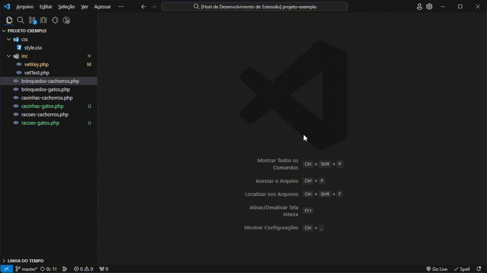
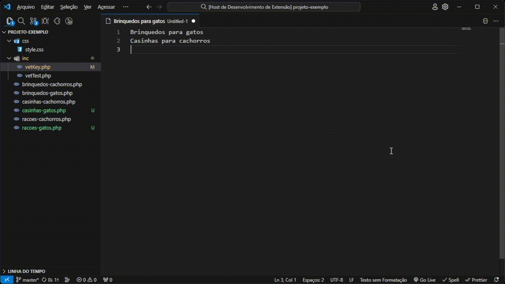
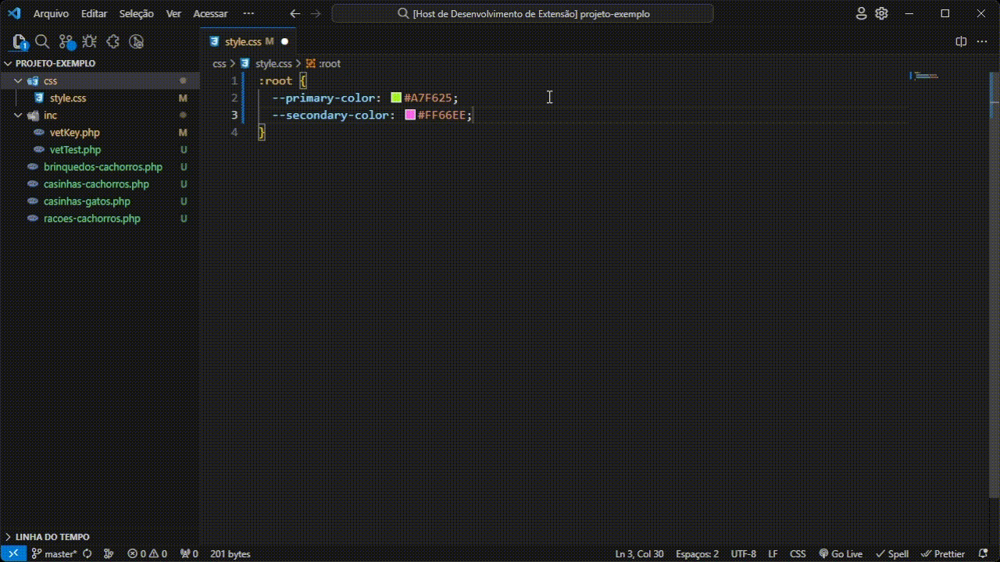
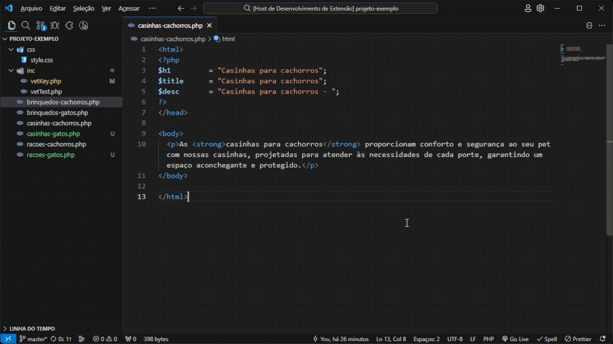
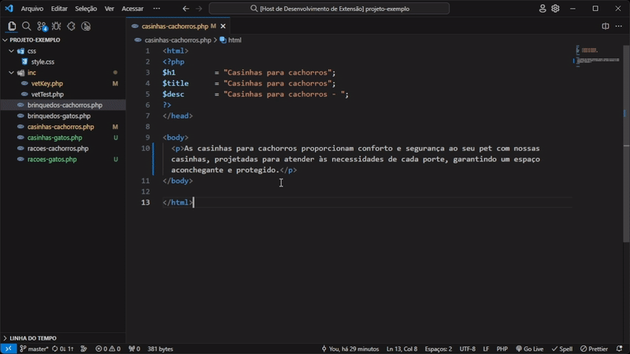
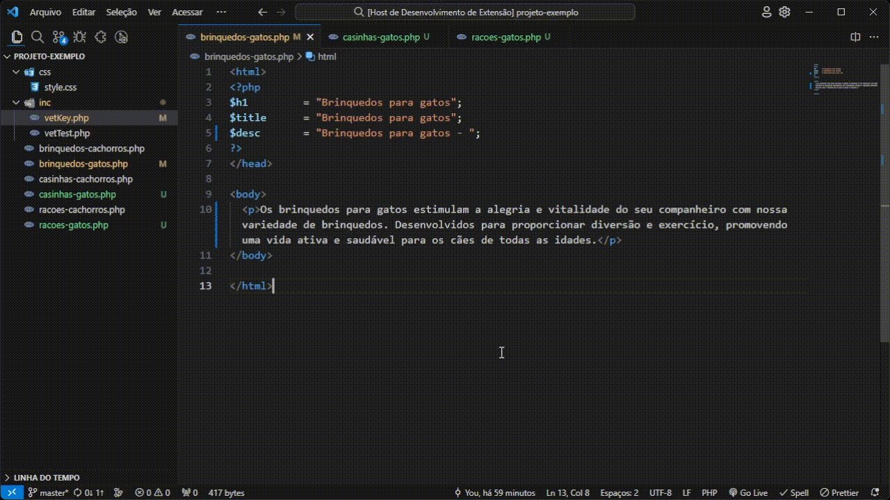
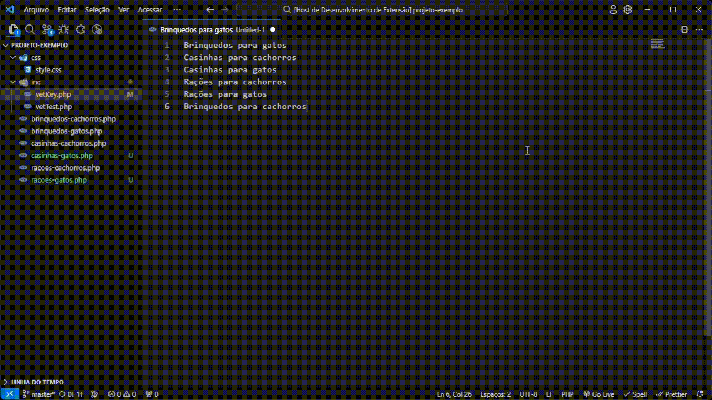
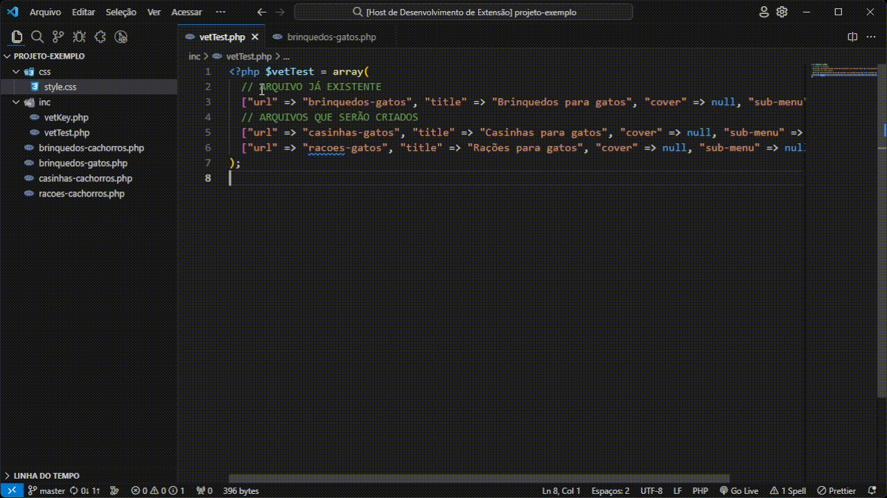

<h1><strong>Drs.</strong></h1>

## 📖 Sobre o projeto

Esta extensão funciona como um kit de ferramentas, pois trás um compilado de funções para aumentar a produtividade e corrigir de erros. 👨🏽‍⚕️🛠️

## 📑 Lista de comandos

- [Abrir arquivos <kbd>ctrl+k a</kbd>](#abrir-arquivos-ctrlk-a)
- [Texto para URL <kbd>ctrl+k t</kbd>](#texto-para-url-ctrlk-t)
- [Formatar arquivos abertos <kbd>ctrl+k f</kbd>](#formatar-arquivos-abertos-ctrlk-f)
- [Descartar alterações e fechar <kbd>ctrl+k q</kbd>](#descartar-altera%C3%A7%C3%B5es-e-fechar-ctrlk-q)
- [Gerar cores <kbd>ctrl+k p</kbd>](#gerar-cores-ctrlk-p)
- [Substituir Description <kbd>ctrl+k d</kbd>](#substituir-description-ctrlk-d)
- [Adicionar strong no texto <kbd>ctrl+k o</kbd>](#adicionar-strong-no-texto-ctrlk-o)
- [Executar comando nos arquivos abertos <kbd>ctrl+k k</kbd>](#executar-nos-arquivos-abertos-ctrlk-k)
- [Transformar em vetor <kbd>ctrl+k v</kbd>](#transformar-em-vetor-ctrlk-v)
- [Criar arquivos <kbd>ctrl+k x</kbd>](#criar-arquivos-ctrlk-x)

## Descrição dos comandos

### Abrir arquivos <kbd>ctrl+k a</kbd>
Comando para abrir arquivos php contidos na raiz do projeto, há duas maneiras de usa-lo:
1. Execute o comando no teclado e em seguida selecione qual será a lista de arquivos a serem abertos;
2. Selecione um ou mais nomes de arquivos e em seguida execute o comando, assim será aberto apenas os arquivos selecionados. 



### Texto para URL <kbd>ctrl+k t</kbd>
Transforma um ou mais textos selecionados em uma url amigável.


### Formatar arquivos abertos <kbd>ctrl+k f</kbd>
Executa a formatação em todos os arquivos que estiverem abertos.
  >⚠️ Ao executar este comando, será utilizado o formatador padrão ou o definido pelo usuário, para arquivos PHP é possível utilizar o [PHP Intelephense](https://marketplace.visualstudio.com/items?itemName=bmewburn.vscode-intelephense-client) ou similares. Atente-se em fechar os arquivos que não devem ser alterados.

### Descartar alterações e fechar <kbd>ctrl+k q</kbd>
Comando para descartar as <strong>alterações não salvas</strong> de um arquivo e o fecha-lo logo em seguida.

### Gerar cores <kbd>ctrl+k p</kbd>
A partir de uma ou mais cores hexadecimais selecionadas, este comando gera uma cor mais clara e outra mais escura.


### Substituir Description <kbd>ctrl+k d</kbd>
Substitui a description de um arquivo de mpi, a nova description é retirada a partir de uma strong com a palavra-chave contida no texto.
  >⚠️ Caso não haja ocorrência do título ou não tenha caracteres suficientes no texto, a substituição não será feita.



### Adicionar strong no texto <kbd>ctrl+k o</kbd>
Adiciona a tag strong em todas as ocorrências da palavra-chave em um arquivo de mpi.


### Executar comando nos arquivos abertos <kbd>ctrl+k k</kbd>
Permite executar os comandos (até o momento) de [Substituir Description <kbd>ctrl+k d</kbd>](#substituir-description-ctrlk-d) e [Adicionar strong no texto <kbd>ctrl+k o</kbd>](#adicionar-strong-no-texto-ctrlk-o) em todos os arquivos PHP abertos no editor.


### Transformar em vetor <kbd>ctrl+k v</kbd>
Transforma as seleções de texto em vetores contendo url, title, cover e sub-menu.


### Criar arquivos <kbd>ctrl+k x</kbd>
Cria páginas a partir de um vetor e um template selecionado, o template pode ser o ```default``` ou uma página do vetor já existente.
  >⚠️ O comando substitui apenas as variáveis no topo das páginas criadas ($h1, $title e $desc), todo o resto do conteúdo deve ser alterado manualmente.


